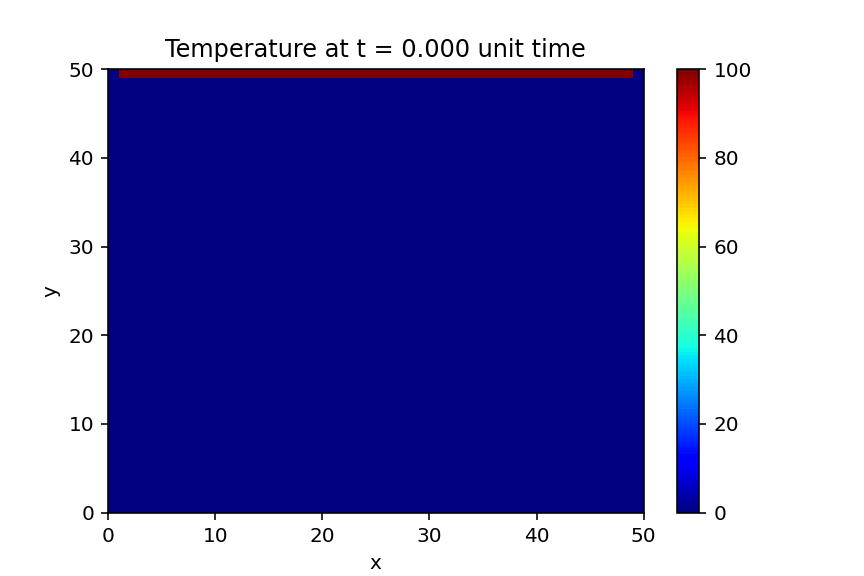

# 2D Heat Equation Solver — Finite Difference Method

This project simulates transient heat conduction across a 2D square 
plate using the explicit finite difference method, implemented from 
scratch in Python.

The simulation models a plate with a fixed high-temperature boundary 
on the top edge (100°C) and zero-temperature boundaries on all other 
edges, showing how heat diffuses inward over time until the system 
approaches steady state.

## Key Concepts Implemented
- Explicit finite difference discretisation of the 2D heat equation
- Fixed (Dirichlet) boundary conditions on all four edges
- Time-stepping stability via the CFL condition
- Animated visualisation of the evolving temperature field

## Tools & Libraries
Python, NumPy, Matplotlib
